# 🔐 認証システム フロー図・シーケンス図

このドキュメントでは、Fishing Conditions Appの認証システムのフロー図とシーケンス図を提供します。

---

## 📊 全体認証フロー図

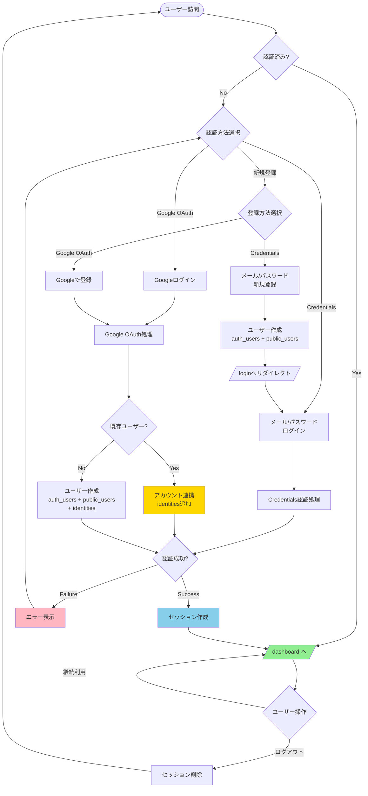

---

## 🔑 Credentials認証シーケンス図

### 新規登録フロー（メール検証付き）

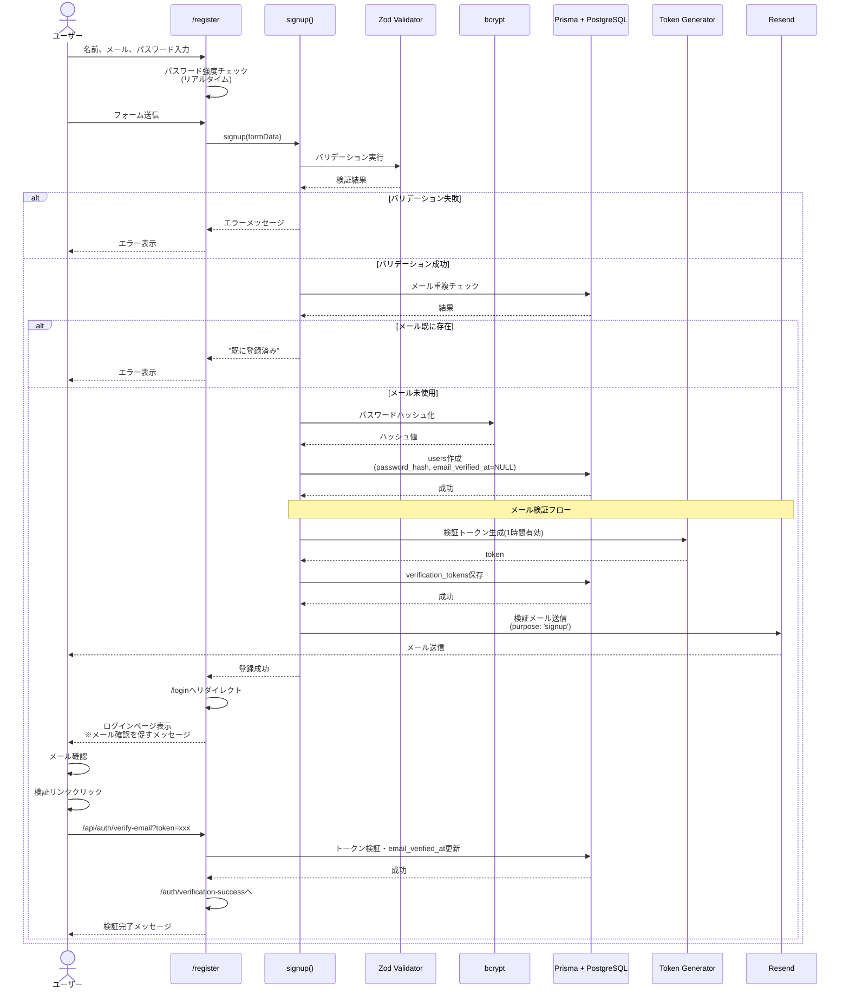

### ログインフロー

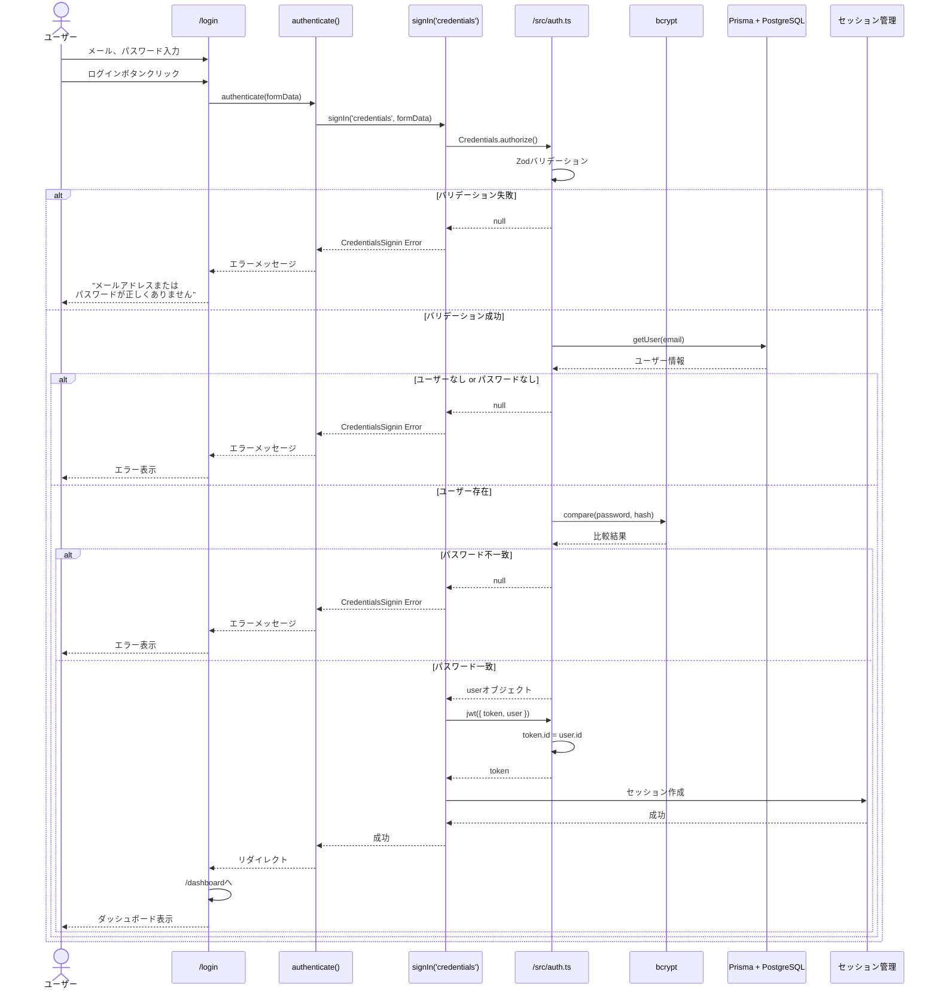

---

## 🌐 Google OAuth認証シーケンス図

### 新規ユーザー登録フロー

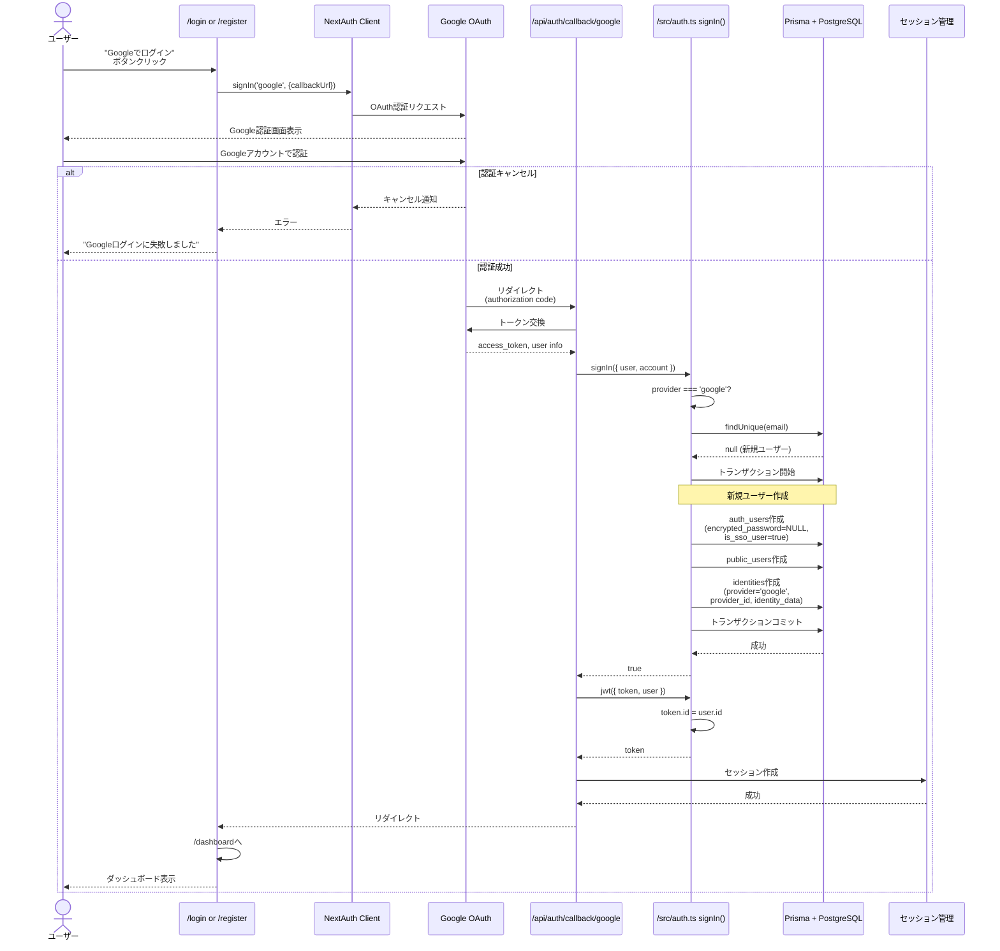

### 既存ユーザーアカウント連携フロー（メール検証付き）

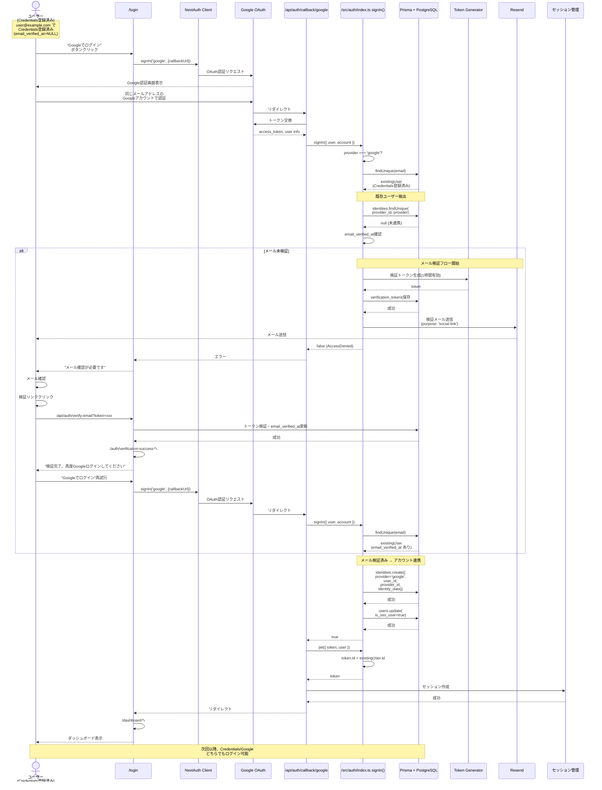

---

## 🔄 アカウント連携状態遷移図

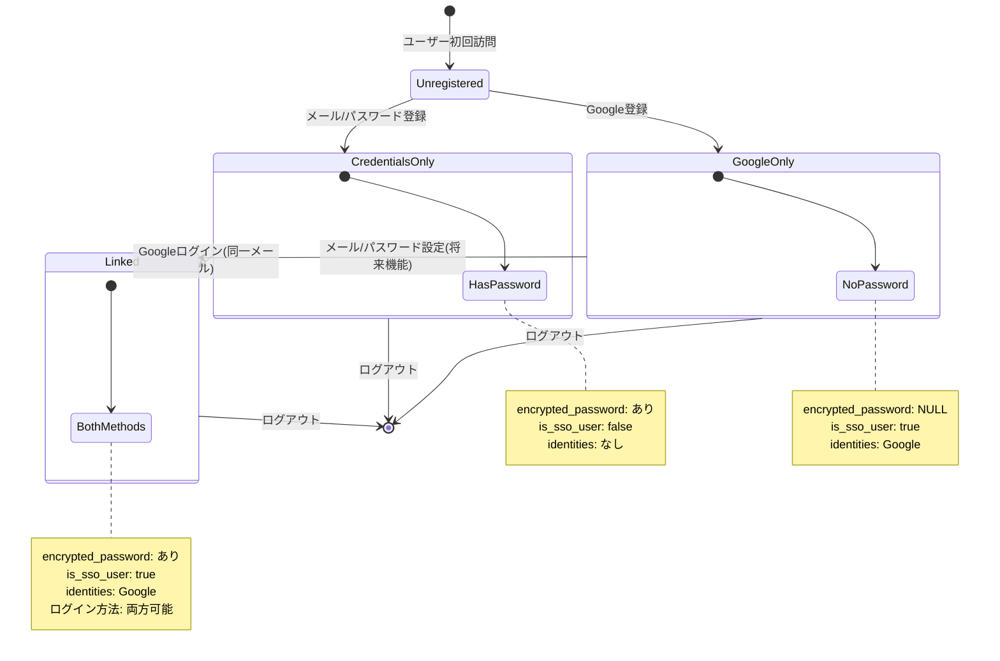

---

## 🗂️ データベーストランザクションフロー図

### 新規Google OAuth ユーザー作成

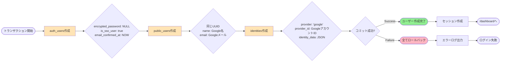

### 既存ユーザーアカウント連携

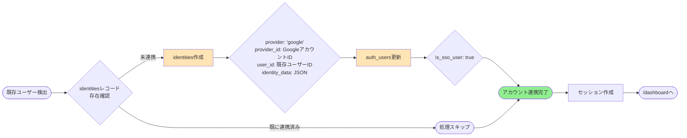

---

## 🔐 セッション管理フロー

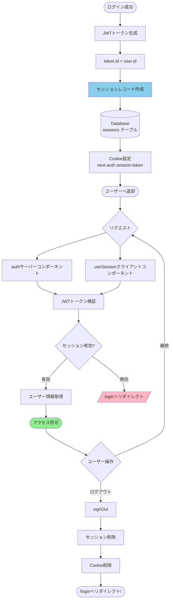

---

## 🛡️ アクセス制御フロー（Middleware）

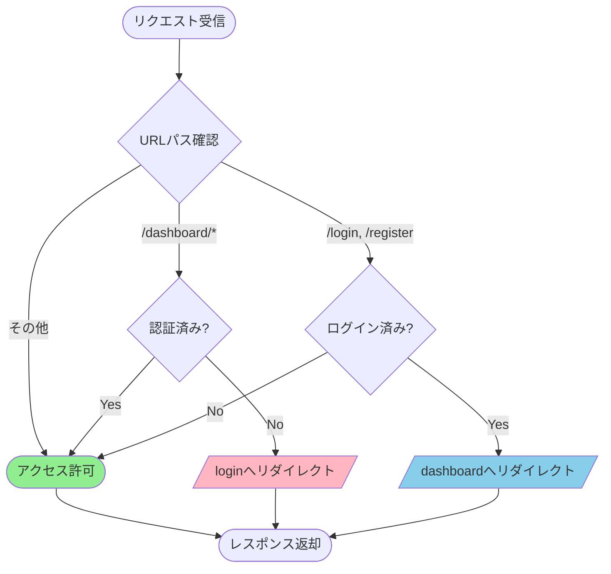

---

## 📋 エラーハンドリングフロー

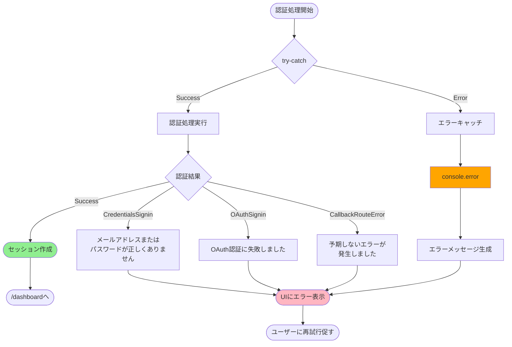

---
