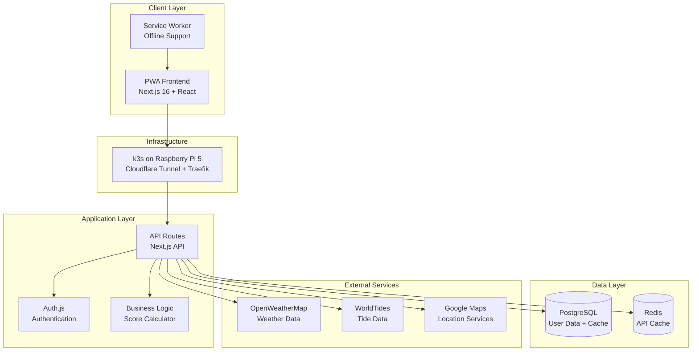
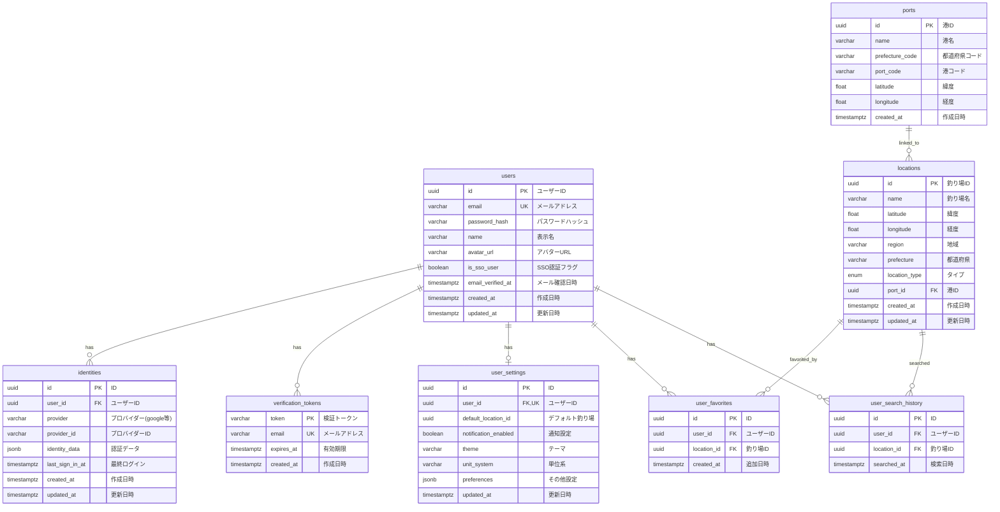
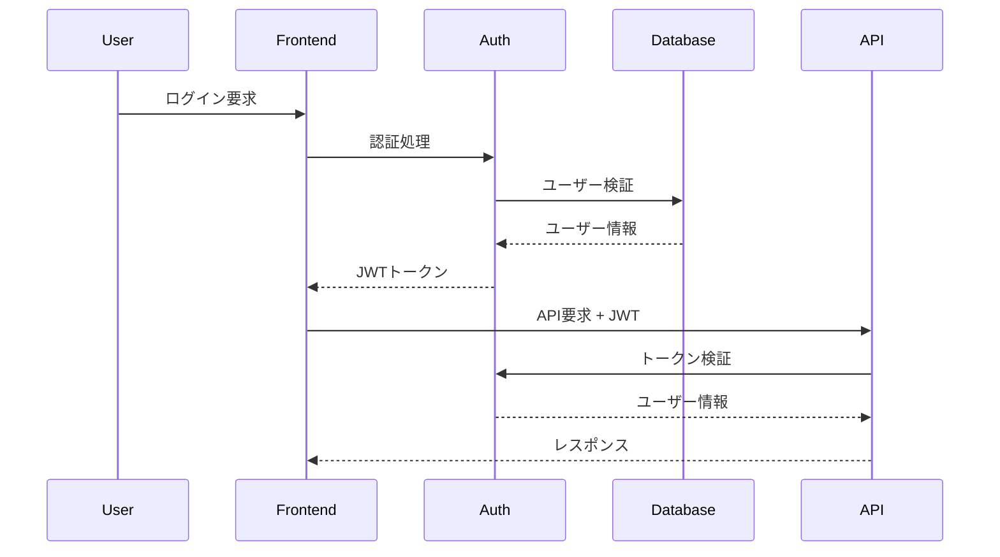

# 🏗️ システムアーキテクチャ

## システム全体構成



---

## 技術スタック

### Phase 1: MVP (Next.js フルスタック)

| レイヤー       | 技術                         | バージョン               | 理由                                     |
| -------------- | ---------------------------- | ------------------------ | ---------------------------------------- |
| フロントエンド | Next.js + React + TypeScript | 16.0.10 + 19.2.3 + 5.9.3 | SSR/SSG対応、PWA化、型安全性             |
| バックエンド   | Next.js API Routes           | 16.0.10                  | 迅速な開発、フルスタック統合             |
| スタイリング   | Tailwind CSS + shadcn/ui     | 4.1.17 + latest          | モバイルファースト、コンポーネント再利用 |
| 状態管理       | Zustand + React Query        | 5.0.8 + 5.90.7           | 軽量、外部API連携に最適                  |
| 認証           | Auth.js (Auth.js)            | 5.0.0-beta.30            | 多様な認証プロバイダー対応               |
| データベース   | PostgreSQL (Neon)            | 17                       | マネージドクラウド、Prisma ORM           |
| キャッシュ     | Redis (k3s Pod)              | 7.x                      | 外部API結果のキャッシュ                  |
| デプロイ       | Raspberry Pi 5 + k3s         | -                        | Cloudflare Tunnel + Traefik、arm64本番   |
| CI/CD          | GitHub Actions → GHCR        | -                        | linux/arm64 ネイティブビルド → kubectl ローリングデプロイ |

> `k8s/` 配下のマニフェストは本番（k3s）一系統である。namespace・Redis・cloudflared は
> [`fishing-infra`](https://github.com/kazumadev619-dev/fishing-infra) が所有する。詳細は [`k8s/README.md`](../../k8s/README.md)。
> ローカル開発に Kubernetes は使わず、`docker compose` に一本化している。

### 将来の拡張性

Phase 1完了後、必要に応じて以下の技術移行を検討：

- バックエンド分離（Go + Gin）
- モバイルアプリ展開（React Native / Flutter）
- マイクロサービス化

---

## フロントエンドアーキテクチャ

### コンポーネント設計パターン（アトミックデザイン）

```
src/
├── app/                # Next.js App Router
│   ├── api/           # API Routes
│   ├── (auth)/        # 認証関連ページ
│   ├── dashboard/     # ダッシュボード
│   └── layout.tsx     # ルートレイアウト
├── components/
│   ├── atoms/         # 最小単位のコンポーネント
│   │   ├── Button/
│   │   ├── Input/
│   │   ├── Icon/
│   │   └── Badge/
│   ├── molecules/     # アトムの組み合わせ
│   │   ├── SearchBox/
│   │   ├── ScoreCard/
│   │   ├── WeatherIcon/
│   │   └── TideIndicator/
│   ├── organisms/     # 複雑なUIブロック
│   │   ├── Header/
│   │   ├── Dashboard/
│   │   ├── ForecastChart/
│   │   └── LocationSelector/
│   └── templates/     # ページレイアウト
│       ├── MainLayout/
│       ├── AuthLayout/
│       └── MobileLayout/
```

### 状態管理アーキテクチャ

```typescript
// Zustand + React Query による状態管理
├── stores/
│   ├── authStore.ts     # 認証状態
│   ├── locationStore.ts # 選択中の場所
│   ├── settingsStore.ts # ユーザー設定
│   └── uiStore.ts      # UI状態
├── hooks/
│   ├── useWeatherData.ts    # 天気データ取得
│   ├── useTideData.ts       # 潮汐データ取得
│   ├── useFishingScore.ts   # スコア計算
│   └── useLocationSearch.ts # 場所検索
```

---

## バックエンドアーキテクチャ

### API設計パターン（Repository Pattern）

```
src/
├── app/api/            # Next.js API Routes
│   ├── auth/          # 認証関連
│   ├── locations/     # 場所関連
│   ├── conditions/    # 環境データ
│   └── user/          # ユーザー関連
├── lib/
│   ├── services/      # ビジネスロジック
│   │   ├── WeatherService.ts
│   │   ├── TideService.ts
│   │   ├── LocationService.ts
│   │   └── ScoreService.ts
│   ├── repositories/  # データアクセス層
│   │   ├── UserRepository.ts
│   │   ├── LocationRepository.ts
│   │   └── CacheRepository.ts
│   └── utils/         # ユーティリティ
│       ├── cache.ts
│       ├── validation.ts
│       └── errors.ts
```

---

## データベース設計

### ER図（Entity Relationship Diagram）



### 各テーブルの詳細説明

#### **認証・ユーザー系**

##### **users** テーブル

- **用途**: ユーザーの基本情報と認証管理
- **使い方**: ログイン時の認証、プロフィール管理、ユーザー識別
- **重要カラム**:
  - `email`: ユニークキー、ログイン用メールアドレス
  - `password_hash`: bcryptでハッシュ化したパスワード（平文は保存しない）
  - `is_sso_user`: Google等のSSO認証を使用しているか判定

##### **identities** テーブル

- **用途**: OAuth連携情報（Google、GitHub等の外部認証）
- **使い方**:
  - 1つのユーザーに複数のOAuth連携が可能
  - 例: 同じメールアドレスでGoogleとGitHubの両方でログイン可能
  - `provider`: 'google', 'github' 等
  - `identity_data`: プロバイダー固有の認証情報をJSON形式で保存

##### **verification_tokens** テーブル

- **用途**: メール検証トークン管理（セキュリティ強化）
- **使い方**:
  - 通常登録時：ユーザー作成後、検証メールを送信しトークンを発行
  - Google OAuth連携時：既存アカウントへの連携前にメール所有権確認
  - トークン有効期限：1時間（`expires_at`）
  - 検証完了後：トークンを削除し`users.email_verified_at`を更新
- **重要カラム**:
  - `token`: crypto.randomBytes(32)で生成した64文字のランダム文字列
  - `email`: ユニークキー、検証対象のメールアドレス
  - `expires_at`: トークン有効期限（1時間後）
- **セキュリティ対策**:
  - `allowDangerousEmailAccountLinking`を使用せず、メール検証で本人確認
  - 期限切れトークンは自動削除される
  - 同一メールアドレスの古いトークンは新規発行時に削除

#### **釣り場・位置情報系**

##### **ports** テーブル

- **用途**: 港マスタデータ。**潮汐API連携に必須**
- **重要性**:
  - 潮汐API（tide736.net）は緯度経度ではなく「都道府県コード + 港コード」で検索
  - 釣り場の潮汐情報を取得するには、位置情報から対応する港を逆引きする必要がある
- **使い方の流れ**:
  ```
  釣り場の座標 (latitude, longitude)
    ↓
  最寄りの港を検索: ports.latitude/longitude で距離計算
    ↓
  ports.port_code を取得
    ↓
  Redisキャッシュで潮汐データを検索（src/lib/cache.ts）
  ```

##### **locations** テーブル

- **用途**: 釣り場マスタデータ
- **使い方**:
  - ユーザーが検索・選択する釣り場情報
  - `latitude`, `longitude` で天気API（OpenWeatherMap）を呼び出す
  - `port_id` で港と紐付けして潮汐データを取得
  - 複数の釣り場タイプ対応（岸釣り、港、河川等）

#### **ユーザー系**

##### **user_favorites** テーブル

- **用途**: ユーザーが☆をつけた「お気に入り釣り場」
- **使い方**:
  - ユーザーが釣り場をお気に入り登録 → テーブルにレコード挿入
  - ダッシュボード「お気に入り一覧」で表示
  - users ←→ locations の中間テーブル
  - 削除時：user_favorites のレコード削除 → locations はそのまま

##### **user_search_history** テーブル

- **用途**: ユーザーが検索した釣り場の履歴
- **使い方**:
  - 検索画面で「最近検索した釣り場」として表示（最新N件）
  - ユーザーの行動分析（人気の釣り場、検索トレンド等）
  - レコード数が増加するため、定期的に古いデータを削除（例: 1年以上前）

##### **user_settings** テーブル

- **用途**: ユーザーの個人設定・プリファレンス
- **特徴**: `user_id` はユニークキー（ユーザー1人に1件のみ）
- **使い方**:
  ```json
  {
    "user_id": "uuid",
    "default_location_id": "uuid", // 初期表示釣り場
    "notification_enabled": true, // 釣り条件通知の有効/無効
    "theme": "dark", // UI テーマ（light/dark）
    "unit_system": "metric", // 単位系（metric/imperial）
    "preferences": {
      "show_moon_phase": true, // 月の満ち欠け表示
      "wind_alert_threshold": 10, // 風速アラート閾値（m/s）
      "auto_refresh_interval": 300 // 自動更新間隔（秒）
    }
  }
  ```

---

### データフロー例：「釣り場Aの今の釣り条件スコアを表示」

```
1. ユーザーが釣り場Aを選択
   ↓
2. 天気データ取得
   - locations(A).latitude, longitude取得
   - Redisキャッシュ確認: [weather:lat:lon] で30分以内のデータ？
   - 有効 → 返す
   - 期限切れ → OpenWeatherMap API呼び出し → Redisにキャッシュ保存
   ↓
3. 潮汐データ取得
   - locations(A).port_id取得
   - ports(port_id).port_code, prefecture_code取得
   - Redisキャッシュ確認: [tide:port_code:date] で6時間以内のデータ？
   - 有効 → 返す
   - 期限切れ → tide736.net API呼び出し → Redisにキャッシュ保存
   ↓
4. スコア計算
   - ScoreService: 天気 + 潮汐 + 時間 → 0-100のスコア算出
   ↓
5. UI表示
   - スコア、天気、潮汐情報をダッシュボードに表示
```

---

### キャッシュ戦略の重要ポイント

> **NOTE**: 天気・潮汐キャッシュはRedisで管理（`src/lib/cache.ts`参照）

| 項目         | 天気キャッシュ（Redis）      | 潮汐キャッシュ（Redis）      |
| ------------ | ---------------------------- | ---------------------------- |
| **対象**     | 天気データ                   | 潮汐データ                   |
| **キー**     | `weather:lat:lon`            | `tide:port_code:date`        |
| **TTL**      | 30分                         | 6時間                        |
| **理由**     | 天気は急変する               | 潮汐は数日先まで予測可能     |
| **実装**     | `src/lib/openWeatherService.ts` | `src/lib/tideService.ts`  |

---

### テーブル関連図（SQL JOIN例）

**釣り場Aの基本情報を取得:**

```sql
SELECT
  l.*,
  p.port_code,
  uf.created_at as favorited_at
FROM locations l
LEFT JOIN ports p ON l.port_id = p.id
LEFT JOIN user_favorites uf ON l.id = uf.location_id AND uf.user_id = ${userId}
WHERE l.id = ${locationId};
-- NOTE: 天気・潮汐データはRedisキャッシュから別途取得
```

### 釣り場タイプ（location_type）

| 値         | 説明                 |
| ---------- | -------------------- |
| `SHORE`    | 岸釣り（堤防・磯）   |
| `SURF`     | サーフ（砂浜）       |
| `PORT`     | 港・漁港             |
| `RIVER`    | 河川・河口           |
| `LAKE`     | 湖・池               |
| `OFFSHORE` | オフショア（船釣り） |
| `OTHER`    | その他               |

### テーブル概要

| カテゴリ         | テーブル              | 説明                                  |
| ---------------- | --------------------- | ------------------------------------- |
| **認証系**       | `users`               | ユーザー情報（認証+プロフィール統合） |
|                  | `identities`          | OAuth連携（Google等）                 |
|                  | `verification_tokens` | メール検証トークン（TTL: 1時間）      |
| **釣り場系**     | `locations`           | 釣り場マスタ                          |
|                  | `ports`               | 港マスタ（潮汐API用）                 |
| **ユーザー系**   | `user_favorites`      | お気に入り釣り場                      |
|                  | `user_search_history` | 検索履歴                              |
|                  | `user_settings`       | ユーザー設定                          |

> **NOTE**: 天気・潮汐キャッシュはPostgreSQLテーブルではなくRedisで管理（`src/lib/cache.ts`）

---

## キャッシュ戦略

### 多層キャッシュアーキテクチャ

```typescript
interface CacheStrategy {
  // L1: ブラウザキャッシュ (Service Worker)
  browserCache: {
    staticAssets: '1年';
    apiResponses: '1時間';
    userPreferences: '永続';
  };

  // L2: CDNキャッシュ (Cloudflare)
  cdnCache: {
    staticPages: '1日';
    apiRoutes: '5分';
    images: '1週間';
  };

  // L3: アプリケーションキャッシュ (Redis)
  appCache: {
    weatherData: '30分';
    tideData: '6時間';
    locationData: '1日';
    userSessions: '7日';
  };

  // L4: データベースキャッシュ (PostgreSQL)
  dbCache: {
    queryResults: 'PostgreSQL内蔵';
    connectionPool: 'Prisma Connection Pool';
  };
}
```

---

## セキュリティアーキテクチャ

### 認証・認可フロー



### メール検証によるセキュリティ強化

- **脅威**: `allowDangerousEmailAccountLinking: true`により、攻撃者が被害者のメールアドレスでGoogleアカウントを作成し、既存アカウントを乗っ取ることが可能だった
- **対策**: メール検証トークンシステムの実装
  - 通常登録時：ユーザー作成後、検証メールを送信（`users.email_verified_at`はnull）
  - Google OAuth連携時：既存アカウント連携前に`email_verified_at`をチェック
  - 未検証の場合：検証メールを送信し、サインインを拒否（AccessDenied）
  - 検証完了後：`users.email_verified_at`を更新し、アカウント連携を許可
- **トークン管理**:
  - 64文字のランダム文字列（`crypto.randomBytes(32)`）
  - 有効期限1時間
  - 検証完了またはタイムアウト時に自動削除
- **実装ファイル**:
  - [src/lib/email.ts](../../src/lib/email.ts): Resend APIでメール送信
  - [src/lib/token.ts](../../src/lib/token.ts): トークン生成・検証・削除
  - [src/app/api/auth/verify-email/route.ts](../../src/app/api/auth/verify-email/route.ts): 検証エンドポイント
  - [src/auth/index.ts](../../src/auth/index.ts): signInコールバックで検証状態チェック
